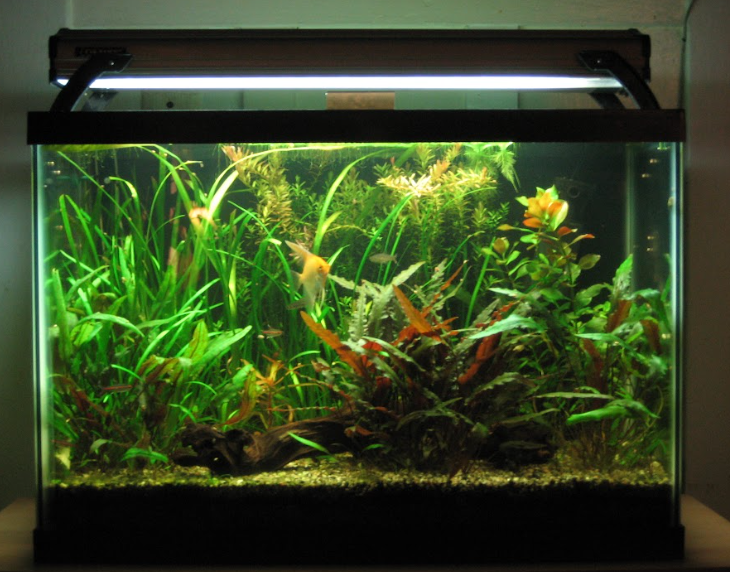
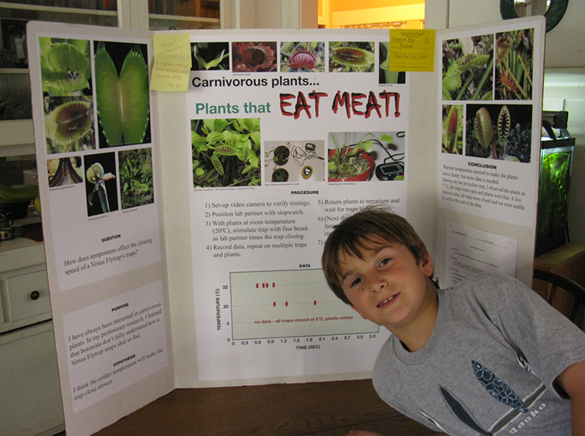
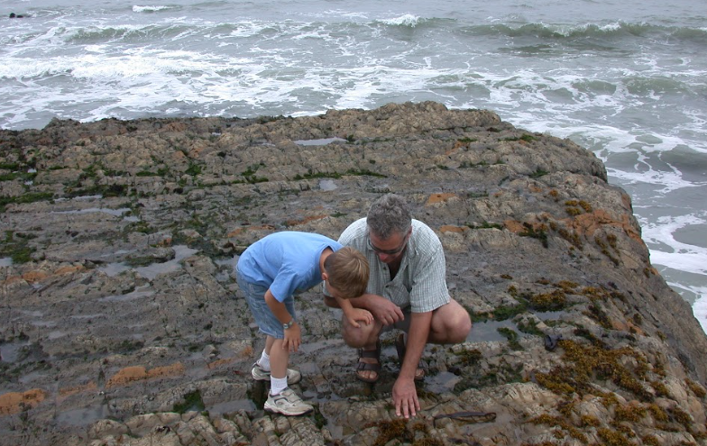
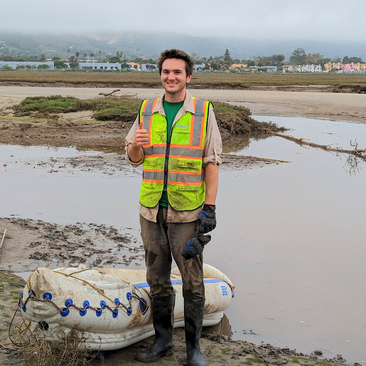
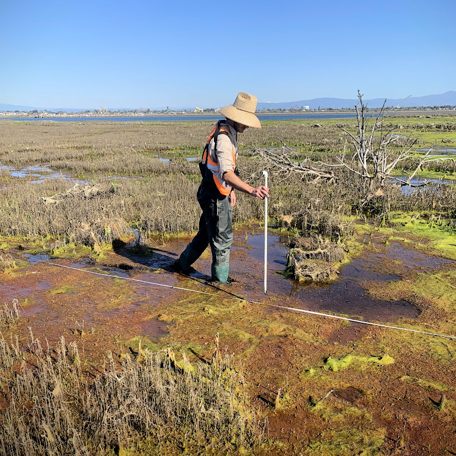
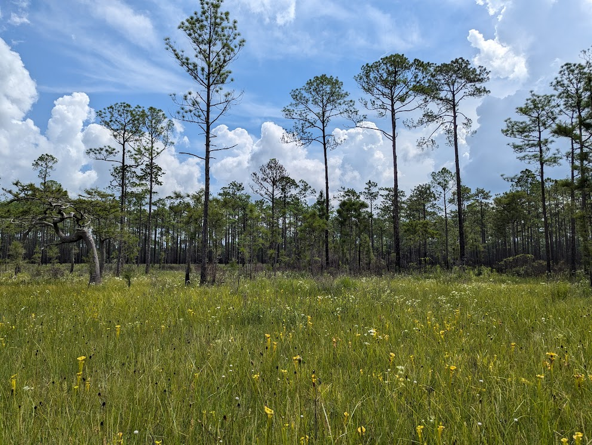

```{r setup, include=FALSE}
knitr::opts_chunk$set(echo = FALSE)
```

As a Long Beach native, CSU Long Beach was a natural choice for college after high school. During my first year at CSULB, I studied music education and performance at the Bob Cole Conservatory of Music. After learning that the music ed lifestyle was not for me, I turned to my life-long interest in the natural sciences. My dad's planted freshwater aquaria were my first introductions into ecology and biology. Trips to the high Mojave with family friends opened my eyes to paleontology and geology. Gardening with my mom exposed me to botany. As I moved away from music, I chose to pursue my oldest fascination, biology.

While working towards my BS in organismal biology, I had the privileged opportunity to work as a research assistant in Dr. Bruno Pernet's marine larval biology lab. This first experience with academia scratched an itch, and I found the problem solving process of experimental design and data analysis addicting. Read more about the work I did in the Pernet Lab on my [Research](https://alexmendelson.com/research.html) page.

The summer before starting graduate school, I completed two distinct internships in wetland conservation. One focused on large-scale restoration projects, where I also led educational tours for visitors ranging from kindergarteners to college students and beyond. The other provided a glimpse into ecological consulting, involving efforts to conserve rare native plants and conduct biotic and abiotic site monitoring.

At Cal State Northridge, I've enjoyed exploring experimental evolutionary ecology, stumbling my way though developing a methodology for working with rotifers endemic to the Purple Pitcher Plant leaf water community. [Learn more about the terHorst Lab here.](https://www.ecoevolab.com/)











