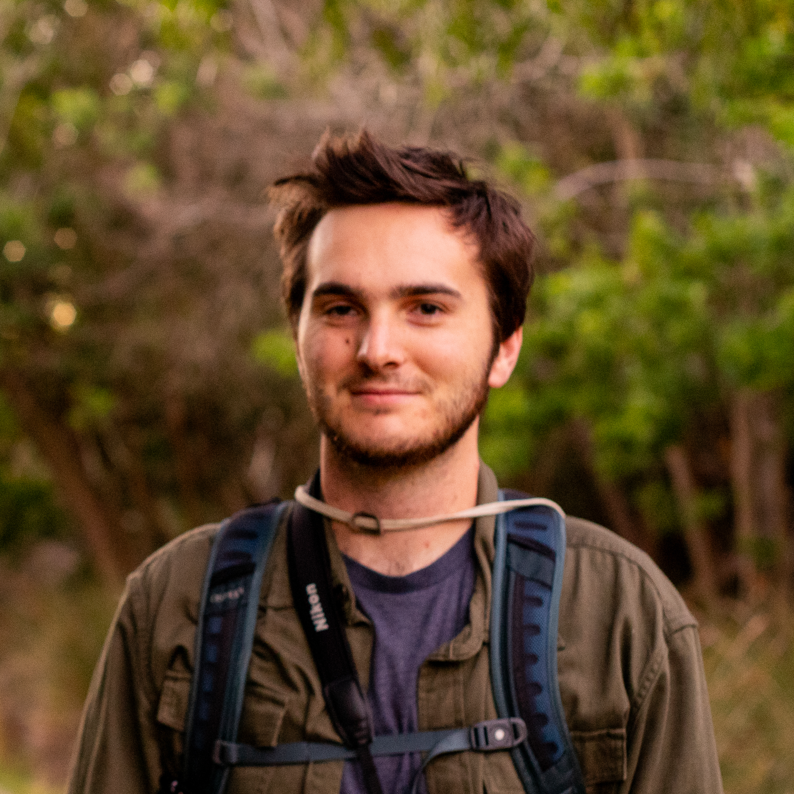

```{r setup, include=FALSE}
knitr::opts_chunk$set(echo = FALSE)
```

:::float-image

```{r out.width = '300px',out.extra = 'style = "display:block; margin:0 auto; padding:10px"', echo = FALSE}

```

:::

I am an evolutionary ecologist interested in the ways populations respond to climate change. Recently, I have focused on how environmental adaptation can mediate indirect effects on species interactions. 

Other research interests include settlement behavior of gregarious marine invertebrate larvae, the complementarity effect of intraspecific diversity on competitive ability in rotifers, plastic response to food availability in the morphology of Echinoid (esp. sea urchin) larvae, and automated feeding systems for invertebrate larval cultures using biofluorescence to measure algal concentrations. You can read about these projects and more on the Research page.

In the past, I have volunteered and worked professionally as a restoration ecologist in coastal wetland systems, including Bolsa Chica, Los Cerritos, and Carpiteria saltmarshes. I also taught a number of introductory biology lab courses during my master's. 

Currently, I am working in environmental consulting while preparing two manuscripts from my MS thesis for publication and mentoring two undergraduate students on their own projects related to my thesis.


<!-- ```{r out.width = '300px', out.extra = 'style = "float:left; padding:10px"', echo = FALSE} -->